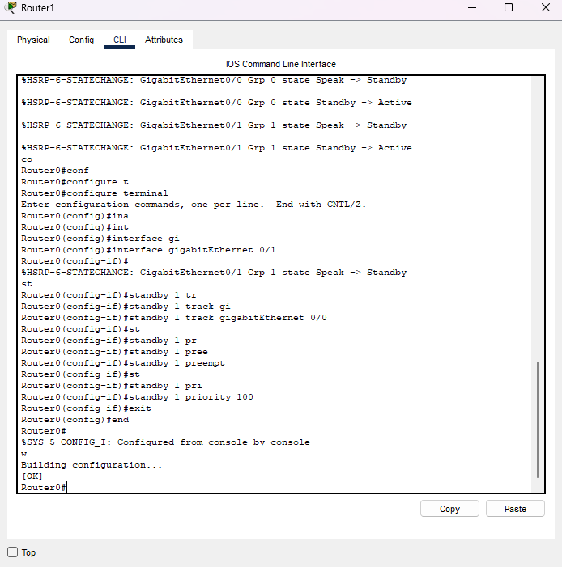
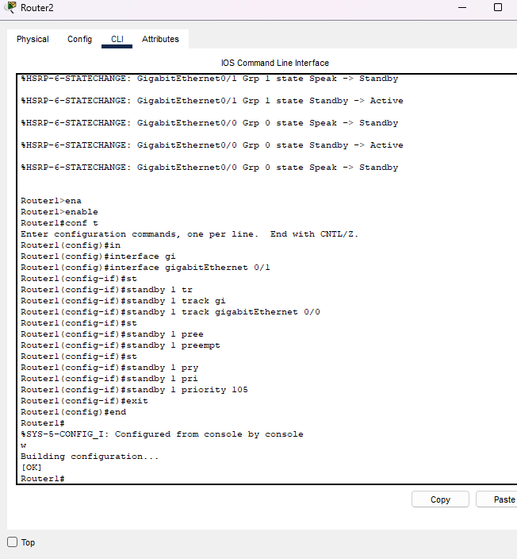
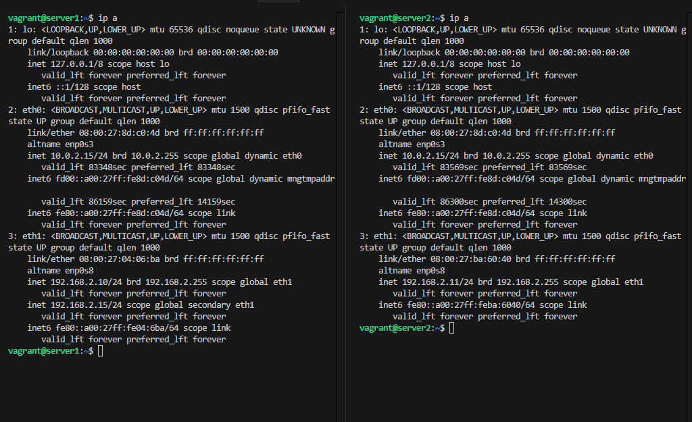
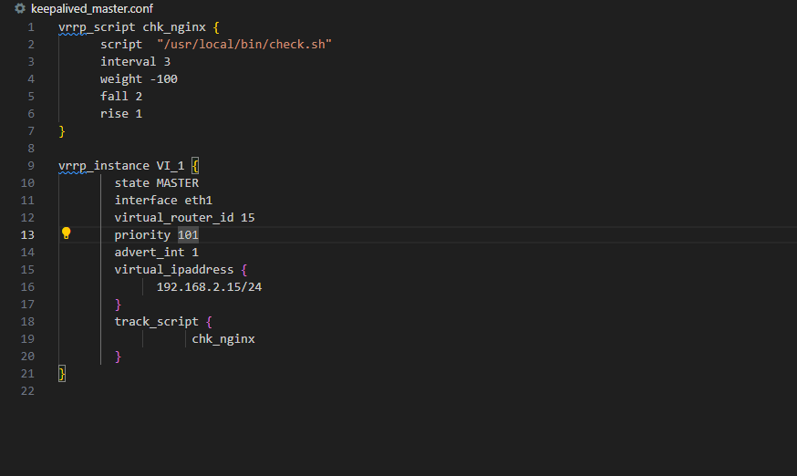
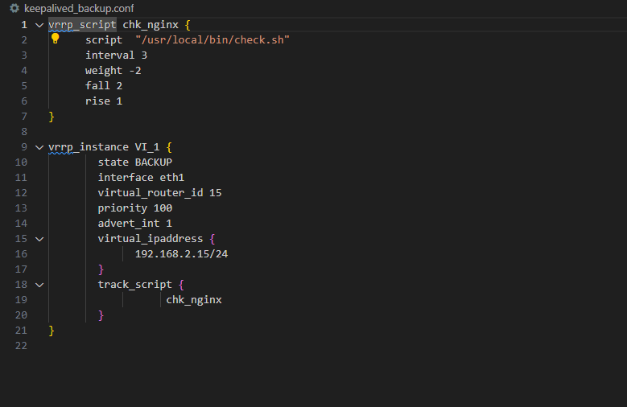
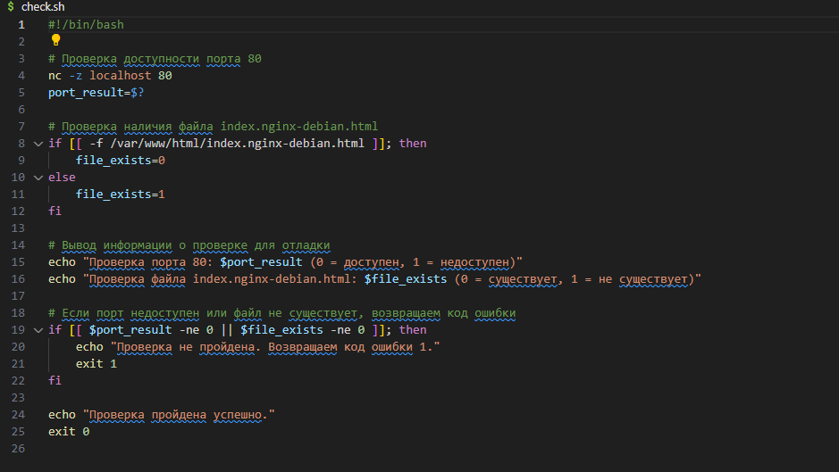

# Домашнее задание к занятию 1 «Disaster recovery и Keepalived»

## Содержание
- [Задание 1: Настройка отслеживания интерфейсов в HSRP](#задание-1-настройка-отслеживания-интерфейсов-в-hsrp)
- [Задание 2: Настройка Keepalived с проверкой работоспособности веб-сервера](#задание-2-настройка-keepalived-с-проверкой-работоспособности-веб-сервера)

## Задание 1: Настройка отслеживания интерфейсов в HSRP

### Описание задания

В данном задании необходимо настроить отслеживание состояния интерфейсов в протоколе HSRP (Hot Standby Router Protocol).

**Исходные условия:**
- Дана схема для Cisco Packet Tracer, рассматриваемая в лекции
- На схеме уже настроено отслеживание интерфейсов маршрутизаторов Gi0/1 (для нулевой группы)

**Задача:**
- Настроить отслеживание состояния интерфейсов Gi0/0 (для первой группы)
- Проверить корректность настройки путем разрыва одного из кабелей между маршрутизатором и Switch0
- Убедиться в работоспособности сети с помощью ping между PC0 и Server0

### Решение

#### Конфигурация Router1

#### Конфигурация Router2

### Файл проекта
[Скачать файл проекта Cisco Packet Tracer](hsrp_advanced+.pkt)

## Задание 2: Настройка Keepalived с проверкой работоспособности веб-сервера

### Описание задания

В данном задании необходимо настроить отказоустойчивый кластер с использованием Keepalived для обеспечения высокой доступности веб-сервера.

**Исходные требования:**
1. Запустите две виртуальные машины Linux
2. Установите и настройте сервис Keepalived, используя пример конфигурационного файла
3. Настройте веб-сервер (nginx или simple python server) на обеих виртуальных машинах
4. Создайте Bash-скрипт для проверки:
   - Доступности порта веб-сервера
   - Существования файла index.html в корневой директории веб-сервера
5. Настройте Keepalived для:
   - Запуска скрипта проверки каждые 3 секунды
   - Переноса виртуального IP на резервный сервер при сбое основного
   - Использования секции vrrp_script для реализации проверки

### Решение

#### Начальное состояние кластера

#### Переключение сервера при остановке nginx

#### Конфигурации серверов

<table>
<tr>
<td width="50%">

**Конфигурация MASTER сервера**

</td>
<td width="50%">

**Конфигурация BACKUP сервера**

</td>
</tr>
</table>

#### Скрипт проверки состояния веб-сервера

